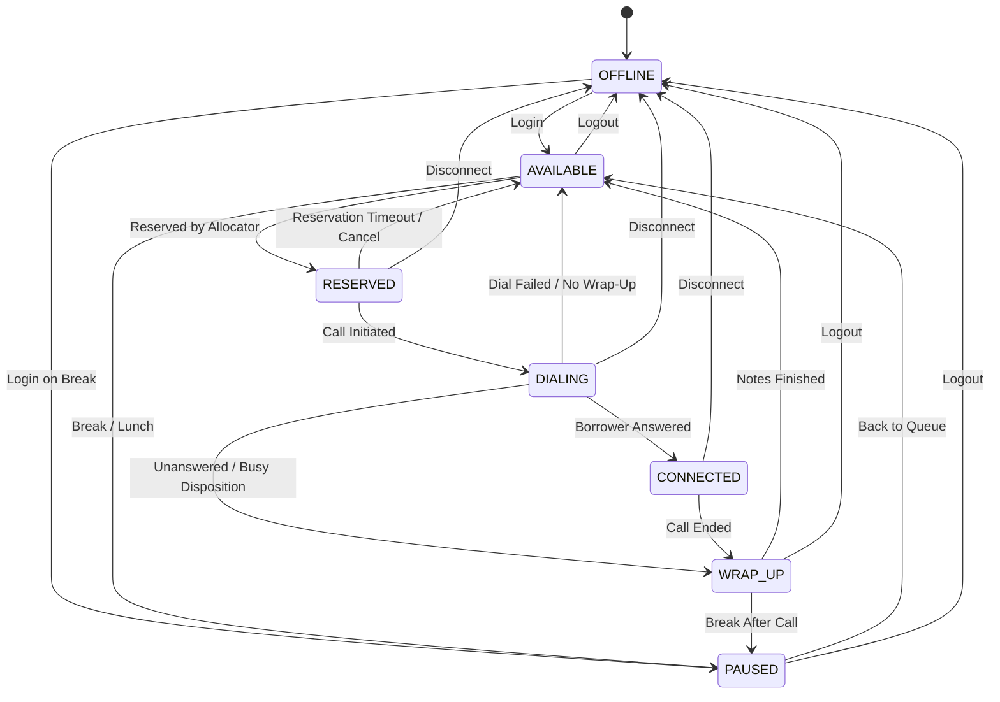
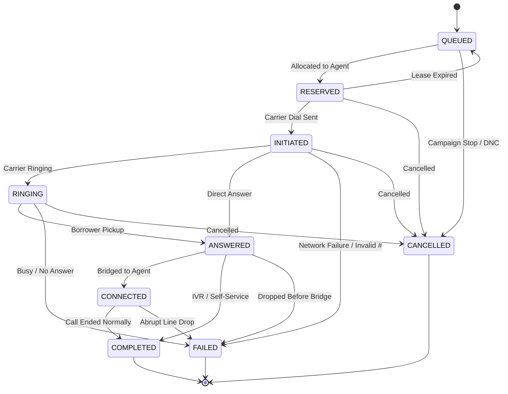

# DialGuard — SmartDialer Prototype for Collections Operations

DialGuard is a deterministic SmartDialer prototype designed to maximize Collections Agent utilization through predictive pacing while enforcing strict, non-bypassable safety controls.

---

## 1. Problem Statement

In collections contact centers, outbound dialing operations face a fundamental trade-off:
- **Under-dialing (Manual / Slow Progressive):** Human collections agents sit idle waiting for calls to connect, wasting high-cost labor.
- **Over-dialing (Unconstrained Predictive):** Placing too many calls leads to answered borrowers having no agent available to speak with, resulting in abandoned calls, compliance violations, and negative borrower experiences.

**DialGuard solves this** by decoupling the **Predictive Pacing Engine** (which statistically recommends dial volume) from the **Safety Controller** (which enforces hard capacity invariants before any call is placed).

---

## 2. Architecture Diagram

```text
               +----------------------------------+
               |     Historical Metrics & State   |
               +-----------------+----------------+
                                 |
                                 v
               +----------------------------------+
               |     Predictive Pacing Engine     |
               | (Statistical Advisory Volume)    |
               +-----------------+----------------+
                                 |
                          Recommends Dials
                                 |
                                 v
               +==================================+
               |        SAFETY CONTROLLER         | <--- Non-Bypassable Gatekeeper
               |  (Deterministic Invariant Check) |
               +=================+================+
                                 |
                          Approves / Throttles
                                 |
                                 v
+--------------------------------+--------------------------------+
|                         Call Allocator                          |
|         (Atomic Agent & Borrower Reservation with Locks)         |
+--------------------------------+--------------------------------+
                                 |
                                 v
+--------------------------------+--------------------------------+
|                    Telecom Provider Interface                    |
|             (Reliable Provider / Flaky Provider)                |
+--------------------------------+--------------------------------+
                                 |
                          Carrier Events
                                 |
                                 v
+--------------------------------+--------------------------------+
|                     Provider Event Handler                      |
|       (Idempotency, Deduplication, Terminal Protection)         |
+--------------------------------+--------------------------------+
                                 |
                          Updates State
                                 |
                                 v
+--------------------------------+--------------------------------+
|                     Shared In-Memory Store                      |
|             (Agents, Calls, Borrowers, Leases)                  |
+--------------------------------+--------------------------------+
```

---

## 3. System Components

| Component | Responsibility |
| :--- | :--- |
| **Domain State Machines** | Enforces valid transitions and terminal protections for `Agent` and `Call`. |
| **In-Memory Repository** | Thread-safe store for agents, calls, and borrowers using reentrant locking. |
| **Call Allocator** | Atomically reserves available agents and queued calls, preventing double-booking. |
| **Telecom Providers** | Simulates external carriers (`ReliableProvider` and `FlakyProvider`). |
| **Provider Event Handler** | Idempotently processes carrier events, handling out-of-order and duplicate signals. |
| **Safety Controller** | Non-bypassable arbiter enforcing hard agent capacity limits and provider health fallbacks. |
| **Predictive Pacing Engine** | Statistical model estimating dial volume based on pickup rates and Little's Law. |
| **Progressive Dialer** | Baseline 1:1 dialer matching available agents directly to outbound calls. |
| **Predictive Dialer** | Full pipeline orchestrating Pacing $\to$ Safety $\to$ Allocator $\to$ Provider. |
| **Recovery Supervisor** | Sweeps expired reservation leases and recovers stuck in-flight calls after worker crashes. |
| **Simulation Suite** | Discrete-event campaign runner benchmarking Scenarios A, B, C, and D. |

---

## 4. Collections Agent State Machine

A **Collections Agent** is a human employee who talks to borrowers.



---

## 5. Call State Machine

A **Call** is an outbound phone interaction with a borrower.



*Terminal States:* `COMPLETED`, `FAILED`, and `CANCELLED` strictly reject all subsequent state modifications.

---

## 6. Progressive Dialing

- **Rule (from Assignment):** `available agents = maximum number of agent-bound outbound calls allowed at that moment`.
- If 10 agents are `AVAILABLE`, at most 10 outbound calls are placed.
- **Trade-off:** Completely eliminates abandoned borrower calls, but leaves agents idle when answer rates are low (e.g. at a 20% pickup rate, agents spend ~70–80% of their time waiting).

---

## 7. Predictive Pacing

The **Predictive Pacing Engine** statistically estimates how many dials are required to produce enough answered calls to keep agents busy:

$$\text{Target Answers} = \max\left(0, (\text{Available Agents} + \text{Expected Wrap-ups}) - (\text{In-flight Calls} \times \text{Answer Rate})\right)$$

$$\text{Recommended Dials} = \frac{\text{Target Answers}}{\text{Effective Answer Rate}}$$

- **Little's Law Lookahead:** Uses `connected_calls / avg_call_duration` to project how many agents will finish active calls during the dial latency window.
- **Advisory Only:** The pacing engine cannot initiate calls directly; it only produces a recommendation passed to the Safety Controller.

---

## 8. Safety Controller

The **Safety Controller** acts as the deterministic gatekeeper before any call allocation:

1. **Zero Available Agents:** If 0 agents are available, no dials are approved.
2. **Maximum Overdial Cap:** Total in-flight calls + new dials cannot exceed `available_agents * max_overdial_ratio`.
3. **Abandonment Risk Bound:** Expected answers cannot exceed available agent capacity.
4. **Provider Health Degradation:** If carrier health drops below threshold (0.70), the controller automatically forces fallback to conservative 1:1 progressive dialing.
5. **Critical Provider Failure:** If carrier health drops below 0.30, all dials are halted immediately.

---

## 9. Concurrency Approach

- **Prototype Decision:** Uses a shared `InMemoryRepository` protected by reentrant locking (`threading.RLock`).
- **Atomic Operations:** `reserve_agent_and_call` executes inside a locked critical section:
  - Validates agent is `AVAILABLE`.
  - Validates call is `QUEUED`.
  - Validates borrower has no existing active in-flight call.
  - Atomically transitions both to `RESERVED` and attaches a lease expiry timestamp.
- Verified under high concurrency (30 threads, 500 borrowers, 50 agents) with **0 double bookings** and **0 duplicate borrower allocations**.

---

## 10. Failure Handling & Recovery

| Failure Scenario | Resolution Mechanism |
| :--- | :--- |
| **Worker Process Crash** | Reservations hold a time-bounded lease. `RecoverySupervisor` sweeps expired leases and returns orphaned calls to `QUEUED` and agents to `AVAILABLE`. |
| **Provider Timeout** | Calls in `INITIATED` past timeout window without events are marked `FAILED`, freeing the agent. |
| **Duplicate Carrier Events** | `ProviderEventHandler` caches `event_id`s and state milestones; duplicates are logged and ignored. |
| **Out-of-Order Events** | Events arriving for terminal calls (`COMPLETED`, `FAILED`) are safely discarded without state corruption. If `ANSWERED` precedes `RINGING`, it progresses directly. |

---

## 11. Telecom Provider Simulation

- **Provider 1 (`ReliableProvider`):** Fast, ordered, deterministic event delivery (`INITIATED` $\to$ `RINGING` $\to$ `ANSWERED` $\to$ `COMPLETED`).
- **Provider 2 (`FlakyProvider`):** Injects realistic carrier faults:
  - Dropped calls and timeouts.
  - Duplicate event delivery.
  - Inverted / out-of-order event sequences.
  - Dynamic health degradation.

---

## 12. How to Run Tests

Run the full pytest suite (96 tests):

```bash
python -m pytest -v
```

Run specific test modules:

```bash
python -m pytest tests/test_allocator.py -v
python -m pytest tests/test_load_concurrency.py -v
python -m pytest tests/test_safety_controller.py -v
```

---

## 13. How to Run Simulation

Run the campaign simulation benchmarking Scenarios A, B, C, and D:

```bash
python -c "import sys; sys.path.insert(0, 'src'); from dialguard.simulation.runner import CampaignSimulator, print_comparison_tables; sim = CampaignSimulator(num_agents=10, num_borrowers=200); print_comparison_tables(sim.run_all_scenarios())"
```

---

## 14. Example Simulation Results

```text
========================================================================================
                 DIALGUARD SMARTDIALER SIMULATION RESULTS                 
========================================================================================

>> Scenario A (Low Answer: 20%, Talk: 120s)
----------------------------------------------------------------------------------------
Metric                               | Progressive Dialer     | Predictive Dialer     
----------------------------------------------------------------------------------------
Calls Attempted                      | 200                    | 200                   
Calls Answered                       | 33                     | 32                    
Calls Completed                      | 33                     | 32                    
Calls Failed / Unanswered            | 167                    | 168                   
Agent Utilization (%)                |                 32.2% |                 32.7%
Safety Throttles / Cap Hits          | 0                      | 60                    
----------------------------------------------------------------------------------------

>> Scenario B (Moderate Answer: 50%, Talk: 90s)
----------------------------------------------------------------------------------------
Metric                               | Progressive Dialer     | Predictive Dialer     
----------------------------------------------------------------------------------------
Calls Attempted                      | 200                    | 200                   
Calls Answered                       | 104                    | 98                    
Calls Completed                      | 104                    | 97                    
Calls Failed / Unanswered            | 96                     | 102                   
Agent Utilization (%)                |                 56.7% |                 61.5%
Safety Throttles / Cap Hits          | 0                      | 59                    
----------------------------------------------------------------------------------------

>> Scenario C (High Answer: 70%, Talk: 180s)
----------------------------------------------------------------------------------------
Metric                               | Progressive Dialer     | Predictive Dialer     
----------------------------------------------------------------------------------------
Calls Attempted                      | 100                    | 96                    
Calls Answered                       | 69                     | 71                    
Calls Completed                      | 60                     | 61                    
Calls Failed / Unanswered            | 31                     | 25                    
Agent Utilization (%)                |                 83.3% |                 84.0%
Safety Throttles / Cap Hits          | 0                      | 59                    
----------------------------------------------------------------------------------------

>> Scenario D (Dynamic Shift: 40% -> 15%, Flaky Carrier)
----------------------------------------------------------------------------------------
Metric                               | Progressive Dialer     | Predictive Dialer     
----------------------------------------------------------------------------------------
Calls Attempted                      | 37                     | 88                    
Calls Answered                       | 25                     | 33                    
Calls Completed                      | 20                     | 30                    
Calls Failed / Unanswered            | 22                     | 65                    
Agent Utilization (%)                |                 15.8% |                 23.2%
Safety Throttles / Cap Hits          | 0                      | 47                    
Progressive Fallback Cycles          | N/A                    | 41                    
----------------------------------------------------------------------------------------
```

---

## 15. Explicit Requirements vs. Implementation Choices

To maintain architectural transparency, below is the distinction between assignment requirements and our prototype implementation decisions:

### Requirements Explicitly Mandated by the Assignment
- Collections Agent states: `OFFLINE`, `AVAILABLE`, `RESERVED`, `DIALING`, `CONNECTED`, `WRAP_UP`, `PAUSED`.
- Call states: `QUEUED`, `RESERVED`, `INITIATED`, `RINGING`, `ANSWERED`, `CONNECTED`, `COMPLETED`, `FAILED`, `CANCELLED`.
- Clear domain exceptions on invalid transitions; state must remain unmodified on error.
- Progressive dialer rule: `available agents = maximum number of agent-bound outbound calls allowed at that moment`.
- Architecture constraint: Pacing Engine recommends $\to$ Safety Controller decides $\to$ Allocator reserves $\to$ Provider initiates.
- Two mock telecom providers (one reliable, one flaky with timeouts, duplicates, and out-of-order events).
- Worker state cannot be sole source of truth; shared state handles crash recovery.
- Scenarios A (20% answer, 120s), B (50% answer, 90s), C (70% answer, 180s), and D (changing conditions).
- No LangChain, LangGraph, LLMs, Redis, Kafka, or microservices.

### Implementation Choices & Configurable Parameters (Our Design Decisions)
- **Shared In-Memory Repository with `threading.RLock`**: Chosen as the simplest, zero-dependency concurrency model for a local Python prototype.
- **Reservation Lease Duration (`default_lease_duration = 30.0s`)**: Configurable duration before an orphaned reservation is recovered.
- **Max In-Flight Timeout (`max_in_flight_timeout_seconds = 60.0s`)**: Threshold to mark stuck carrier calls as failed.
- **Safety Overdial Ratio (`max_overdial_ratio = 3.0`)**: Configurable ceiling on in-flight calls relative to available agents.
- **Provider Health Thresholds (`min_provider_health = 0.70`, `critical_provider_health = 0.30`)**: Thresholds triggering progressive fallback and emergency dial halt.
- **Little's Law Completion Lookahead (`dial_latency_seconds = 5.0s`)**: Heuristic forecasting agent availability during dial latency.
